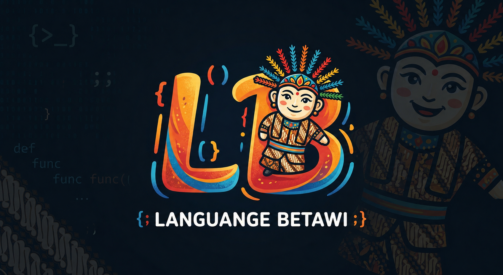

<p align="center">
  
</p>

<h1 align="center">Language Betawi</h1>

<p align="center">
  <b>A standalone backend programming language, written entirely in Betawi/Jakarta-gaul dialect.</b><br>
  No Python. No Node. No external runtime. Just one native binary, built from scratch in Go.
</p>

<p align="center">
  
  
  
  
  
  
</p>

---

## What is this?

Language Betawi is a real, from-scratch programming language — lexer,
parser, and tree-walking evaluator, all hand-written in Go — where every
keyword is a word from Betawi/Jakarta street dialect instead of English or
formal Indonesian. `print` is `ngomong`. `if` is `kalo`. `function` is
`bikinGaya`. It compiles to a single, dependency-free native binary and
is aimed squarely at backend work: HTTP servers, routing, and database
access, straight out of the box.

It's also **typo-tolerant by design**. The lexer doesn't just recognize one
fixed spelling per keyword — it understands dozens of dialect synonyms out
of the box, and if you still manage to typo one, a built-in fuzzy matcher
(Levenshtein distance, length-normalized) will catch it, tell you what it
assumed you meant, and keep compiling instead of crashing.

```
ngomongg("santai bre, ini masih kena")
```
```
⚠️  [Woro-woro] Lu ngetik 'ngomongg' di baris 1 ye? Gua anggep maksud lu
'ngomong' (cocok 88%). Kode tetep jalan, tapi rapihin lagi besok-besok, tong!
```

## Key features

- **Zero external runtime.** Everything — lexer, parser, evaluator,
  embedded SQLite, HTTP server — is compiled into one native `.exe`. No
  Python, no Node, no JVM, nothing to install alongside it.
- **Three-layer Betawi understanding.**
  1. A hardcoded core grammar (`internal/lexer/token.go`)
  2. A structured synonym map — dozens of real dialect/slang words per
     keyword (`internal/lexer/keywords.go`)
  3. Levenshtein-based fuzzy matching with a length-normalized 80%
     similarity threshold for typo tolerance (`internal/lexer/fuzzy.go`)
- **Backend-first standard surface.** Native syntax for starting an HTTP
  server and defining routes, plus a built-in embedded SQLite query
  function — no external database server required.
- **Every error message speaks Betawi.** Syntax errors, runtime errors,
  and fuzzy-match notices are all phrased in the same consistent
  street-Betawi voice (`internal/betawimsg/`) — never generic Go/English
  compiler output.
- **Error-tolerant parser.** Like a production compiler (Go, Rust), it
  collects every parse error it can find and keeps going instead of
  stopping at the first one, so you fix everything in one pass.
- **Extensible vocabulary.** `RegisterDialectPack()` lets anyone merge in
  additional dialect word packs (Betawi Ora, Betawi Tengahan, regional
  variants) at runtime without touching the core lexer.

## Quick example

```betawi
// hello.bwi
nama entu "Betawi"
ngomong("Woi, gua jalan pake bahasa " + nama + "!")

kalo (bener) {
    cuap("Masuk ke percabangan kalo/if.")
} kaloKagak {
    cuap("Ini cabang else.")
}

bikinGaya sapa(nama_orang) {
    balikin "Woi " + nama_orang + ", apa kabar?"
}

ngomong(sapa("Bro"))

i entu 0
musing (i < 3) {
    ngomong("Ngulang ke-" + i)
    i entu i + 1
}
```

```
> betawi hello.bwi
Woi, gua jalan pake bahasa Betawi!
Masuk ke percabangan kalo/if.
Woi Bro, apa kabar?
Ngulang ke-0
Ngulang ke-1
Ngulang ke-2
```

## Installation

### Windows — installer (recommended)

Download `betawi-installer.exe` from the [Releases](../../releases) page
and run it. It's a standard setup wizard:

Welcome → *(Existing Installation, if detected)* → Progress → Finish

It requires **administrator rights** (it registers `betawi` in your
machine-wide System PATH so it works from any terminal), extracts the
compiler with a real byte-accurate progress bar, and finishes with
*"Betawi language successfully downloaded."* Afterward, open a **new**
terminal window and:

```
betawi --help
```

> **Note on SmartScreen:** since this binary isn't code-signed, Windows
> may show a "Windows protected your PC" warning. Click **More info → Run
> anyway**. This is standard for unsigned executables, not a sign
> something's wrong — verify the download's checksum against the one
> published on the Releases page if you want extra assurance.

### Build from source (any platform, for the compiler itself)

```
git clone <this-repo>
cd language-betawi
go get modernc.org/sqlite
go mod tidy
go build -o betawi ./cmd/betawi
./betawi examples/hello.bwi
```

Building the Windows installer itself needs a few more one-time steps —
see [BUILDING.md](BUILDING.md) for the full developer/build guide.

## Syntax reference — Kamus Betawi (the Betawi dictionary)

Every concept below can be written using **any** of its listed synonyms —
the lexer treats them as fully interchangeable. This table also doubles
as the current state of `internal/lexer/keywords.go`.

| Concept | Betawi keyword(s) | Meaning |
|---|---|---|
| Print / output | `ngomong`, `kasiTau`, `nyablak`, `cuap`, `ngecap`, `cerocos`, `ngoceh`, `cakcek` | Print/output a value |
| Assignment | `entu`, `tuh` | `nama entu "Budi"` → `nama = "Budi"` |
| If | `kalo`, `kalu` | Conditional branch |
| Else | `kaloKagak`, `kaloKaga`, `laenKagak` | Else branch |
| Loop | `musing`, `ngulang`, `terosNgulang` | `while`-style loop |
| Function | `bikinGaya`, `bikinJurus`, `bikinAksi` | Function declaration |
| Import | `bawa`, `ngajak`, `colek` | Module import |
| Return | `balikin`, `kasihBalik`, `baliqin` | Return a value from a function |
| True | `bener`, `beneran`, `topMarkotop` | Boolean true |
| False | `kagak`, `kaga`, `kagaDah`, `gakada` | Boolean false |
| Null / nothing | `zonk`, `kapiran`, `keder` | An explicit "nothing" literal |
| Start web server | `bukaWarung`, `bukaLapakGede` | Starts a real, blocking HTTP server |
| Define route | `bikinLapak`, `gelarLapak` | Registers an HTTP route handler |
| Database query | `tanyaDatabase`, `nanyaKeDatabase`, `colekDatabase`, `cariinData` | Runs a query against the embedded SQLite database |

**Runtime type names** (used inside error messages, e.g. *"lu masukin
bacotan padahal butuhnya biji"*):

| Type | Betawi name |
|---|---|
| Integer | `biji` |
| Float | `biji desimal` |
| String | `bacotan` |
| Boolean | `bener/kagak` |
| Null | `zonk` |
| Array | `kropak` |
| Map | `kropak berlabel` |
| Function | `gaya` |
| Error | `kapiran` |

> **A note on authenticity:** this vocabulary is a curated, best-effort
> set in the street-Betawi/Jakarta-gaul register, grounded against
> documented Betawi/Jakarta slang sources — not an exhaustive academic
> corpus. Real Betawi dialect varies a lot by sub-region (Tengahan vs.
> Ora vs. Tangerang) and generation. Corrections and additions from
> native speakers are genuinely welcome — see Contributing below.
>
> On "purity": Betawi is itself a Malay-derived dialect, the same root
> family as standard Indonesian, so total etymological separation isn't
> a coherent goal for any Betawi wordlist. What this vocabulary does
> avoid is *formal-register* Indonesian — words you'd hear on the news,
> not on the street — keeping only informal, colloquial forms.

## More examples

**Backend: HTTP server + embedded SQLite**

```betawi
// webserver.bwi
tanyaDatabase("CREATE TABLE IF NOT EXISTS warga (nama TEXT, umur INTEGER)")
tanyaDatabase("INSERT INTO warga (nama, umur) VALUES ('Bro', 30)")

bukaWarung(8080) {
    bikinLapak("/halo") {
        ngomong("Assalamualaikum dari server Betawi!")
    }

    bikinLapak("/warga") {
        data entu tanyaDatabase("SELECT * FROM warga")
        ngomong(data)
    }
}
```

```
betawi webserver.bwi
# Woi, warung buka di port 8080 — 2 lapak siap dipake! Cus akses http://localhost:8080
```

**A syntax error, Betawi-style**

```betawi
kalooo (bener) {
    ngomong("typo kejauhan buat fuzzy-match nyelametin")
}
```

```
Waduh amsyong bre! Lu ngetik 'kalooo' di baris 1. Kagak ada kata kayak
gitu di kamus kita, betulin sono, tong! [kolom 16]
```

## Roadmap

- [ ] Array/map literal syntax (`[1, 2, 3]`, `{ ... }`) — currently these
      types exist at runtime (e.g. SQL query results) but aren't yet
      constructible directly in source
- [ ] `bawa`-driven real stdlib module system (currently a forward-
      compatible no-op marker)
- [ ] Expanded, community-reviewed dialect vocabulary
- [ ] Code-signed installer releases

## Note

I will create the full documentation for Lang-Betawi on the website later, 
don't forget to keep checking my social media for the latest updates on Lang-Betawi.


https://www.instagram.com/ditzzblu


https://discord.gg/yPrShepC68
